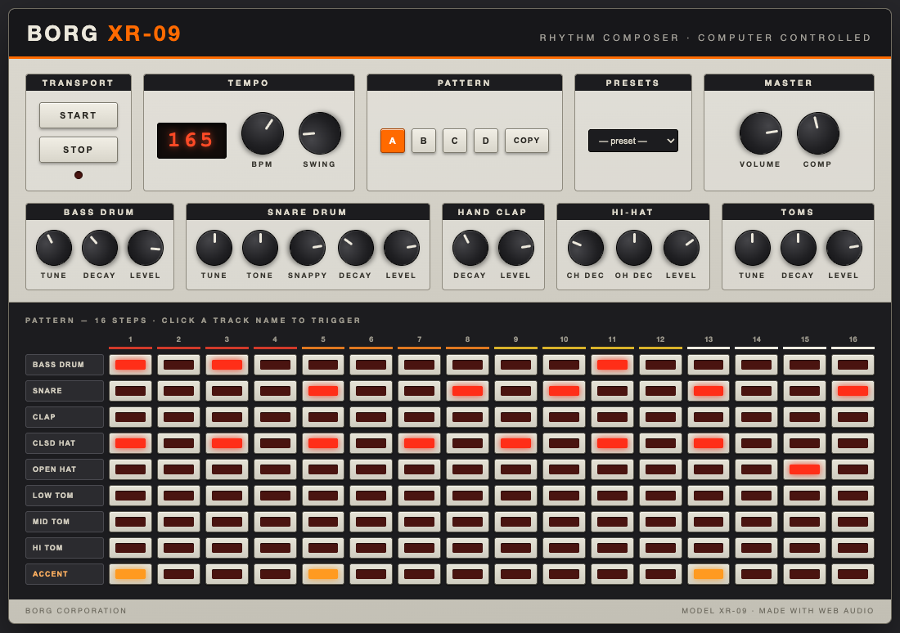

# BORG XR-09 — Rhythm Composer

A simple yet legendary web drum machine inspired by the Roland TR-909.

- **Single-file** — the whole instrument lives in `index.html`, no build, no dependencies
- **Fully synthesized sounds** — Web Audio API, no samples
- **8 voices** — kick, snare, clap, closed/open hi-hat (with choke), 3 toms
- **16-step sequencer** — lookahead scheduler on top of the audio clock, 50–75% swing, accent row
- **Pattern banks A–D** with copy + 9 factory presets (house, breakbeat, jungle, electro, techno, boom bap, UK garage, dembow, liquid DnB)
- **Analog feel** — per-hit humanization (tuning/decay/level drift), RC envelopes, analog bus with saturation and parallel compression (COMP knob)
- Sister synthesizer project: [BORG XS-20](https://github.com/oskar-stierand/borg-xs20)

## Getting started

Open `index.html` in Chrome. That's it.

## Development

Tasks live in the `tasks/` folder (one `.md` file per task), the workflow is described in `CLAUDE.md`, and version history in `CHANGELOG.md`. Snapshots of each version are kept in `versions/`.
